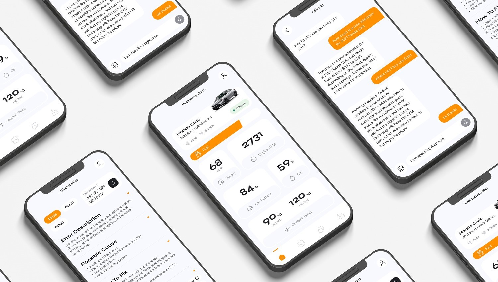

# garaage

<!--  -->

A mobile application developed with Flutter, Google Gemini API, and Google ARCore, designed to revolutionize vehicle diagnostics and maintenance. By leveraging an OBD2 (On-board diagnostics) scanner, the app provides detailed diagnostic reports and maintenance recommendations, ensuring users can efficiently manage their vehicle's health. This project was developed for the Google Gemini API Developer Competition 2024, showcasing the integration of advanced Google's technologies.

_Check out the Figma high fidelity prototype designs [_here_](https://www.figma.com/design/YdUcQaqNCCKZ5ZTA5HZhlf/garaage?node-id=1-2&t=5zR3jATXVg4i26S8-1)._

> [!IMPORTANT]
> Please note that the app requires an OBD2 scanner to connect to your vehicle and retrieve real-time diagnostic information. Also, the AI model is currently trained for a limited number of vehicles and may not support all vehicle models.

## Table of Contents

<!-- * [Screenshots](#screenshots) -->
* [Acknowledgements](#acknowledgements)
* [Technologies](#technologies)
* [Usage](#usage)
  * [Prerequisites](#prerequisites)
  * [Installation](#installation)
  * [Run The App](#run-the-app)
* [Features](#features)
  * [User Authentication and Management](#user-authentication-and-management)
  * [Vehicle Diagnostics and Maintenance](#vehicle-diagnostics-and-maintenance)
  * [Real-time Vehicle Information](#real-time-vehicle-information)
  * [Interactive Assistance](#interactive-assistance)

## Acknowledgements

* Noufil Saqib [GitHub](https://github.com/noufilsaqib) [LinkedIn](https://www.linkedin.com/in/muhammad-noufil-saqib/)
* Towa Quimbayo [GitHub](https://github.com/towaquimbayo) [LinkedIn](https://www.linkedin.com/in/towa-quimbayo/)
* Mangat Toor [GitHub](https://github.com/immangat) [LinkedIn](https://www.linkedin.com/in/immangat)
* Abhishek Chouhan [GitHub](https://github.com/abhishekchouhannk) [LinkedIn](https://www.linkedin.com/in/abhishekchouhannk)
* Bhavnoor Saroya [GitHub](https://github.com/BhavnoorSaroya) [LinkedIn](https://www.linkedin.com/in/bhavnoor-saroya)

[](https://github.com/immangat/GeminiHackahton/graphs/contributors)

## Technologies

* Cloud Firestore `v5.1.0`
* Dash Chat `v0.0.21`
* Firebase Auth `v5.1.2`
* Firebase Core `v3.2.0`
* Flutter `>=3.4.3 <4.0.0`
* Flutter Bloc `v8.1.6`
* Google AI Dart SDK `0.4.3`
* Google ARCore
* Google Gemini API `v1.5 Pro`
* Google Sign In `v6.2.1`
* Hydrated Bloc `v9.1.5`
* Speech to Text `v6.6.2`

## Usage

<details>
  <summary>Prerequisites</summary>

### Prerequisites

* [Flutter SDK](https://flutter.dev/docs/get-started/install)
* [Dart SDK](https://dart.dev/get-dart)
* [Android Studio](https://developer.android.com/studio)
* [VS Code](https://code.visualstudio.com/)
* [OBD2 Scanner](https://www.amazon.com/s?k=obd2+scanner)

</details>

<details>
  <summary>Installation</summary>

### Installation

1. Clone the repository to your local machine:

  ```sh
  git clone https://github.com/immangat/GeminiHackahton.git
  ```

2. Install the required dependencies:

  ```sh
  flutter pub get
  ```

</details>

<details>
  <summary>Run The App</summary>

### Run The App

In order to run the application, you need to have an Android emulator or a physical device connected to your computer. You can use the following commands to run the app:

```sh
flutter run
```

The app will be built and deployed to your emulator or device. You can interact with the app using the on-screen controls or your device's touch screen.

</details>

## Features

Leveraging Google's advanced technologies to enhance the app's functionality and user experience. The app integrates with Google Gemini API, Google ARCore, and other Google services to provide cutting-edge features and capabilities.

### User Authentication and Management

Securely authenticate users and manage user accounts using Firebase Auth and Cloud Firestore. Users can sign in using their Google account or email address and password. The app provides secure user authentication and registration, ensuring user data is protected and secure.

* __User Authentication__: Securely authenticate users using Firebase Auth. The app provides secure user authentication and registration using Firebase Auth. Users can sign in using their Google account or email address and password.
* __Google Sign In__: Enable users to sign in using their Google account. The app supports Google Sign In, allowing users to sign in using their Google account. Users can securely authenticate and access the app's features and functionalities using their Google account.
* __Profile Management__: Manage your profile, vehicle information, and preferences. The app allows users to create and manage their profiles, add multiple vehicles, and customize their preferences. Users can view and update their personal information, vehicle details, and settings.

### Vehicle Diagnostics and Maintenance

Enhancing vehicle management with advanced diagnostics and maintenance recommendations. The app provides real-time vehicle information, diagnostic analysis, and maintenance recommendations to ensure your vehicle is in optimal condition.

* __OBD2 Integration__: Connect your vehicle via Bluetooth using an OBD2 scanner for real-time diagnostics and vehicle registration. The OBD2 scanner provides self-diagnostic and reporting capabilities to the app.
* __Diagnostic Analysis__: Perform comprehensive diagnostic checks on your vehicle. The app uses the Google Gemini API to interpret OBD2 error codes and generate detailed reports including the error code, description, possible causes, recommended maintenance, and more.

### Real-time Vehicle Information

Access real-time vehicle information and statistics to monitor your vehicle's health, conbdition, and performance. The app provides detailed insights into your vehicle's status, including fuel consumption, engine temperature, battery voltage, and more.

* __Dashboard__: View essential vehicle information and key metrics such as fuel consumption, mileage, battery voltage, RPM, engine temperature, and more.
* __Bluetooth Connection__: Seamlessly connect to the OBD2 scanner using your phone's Bluetooth to retrieve and access real-time vehicle information and statistics. The app uses the OBD2 scanner to communicate with your vehicle and retrieve data.

### Interactive Assistance

Get interactive assistance and support through the app's AI chatbot and AR identification features. The app uses Google's advanced technologies to provide interactive assistance, troubleshooting tips, and augmented reality identification of vehicle components.

* __Chatbot Integration__: Use the Google Gemini-powered chatbot for instant assistance and interactive support. The chatbot provides real-time responses to your queries, offers troubleshooting tips, and guides you through the app's features and functionalities. Users can ask questions, send text, photos, and audio recordings to get detailed assistance regarding their vehicle.
* __AR Identification__: Use Google ARCore to identify and locate vehicle components and parts. The app uses augmented reality to provide an interactive and immersive experience for users to identify and locate vehicle parts, components, and systems. Users can point their phone's camera at the vehicle to view detailed information about specific parts and components.
